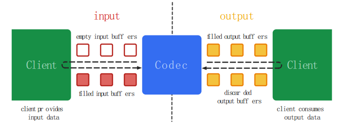
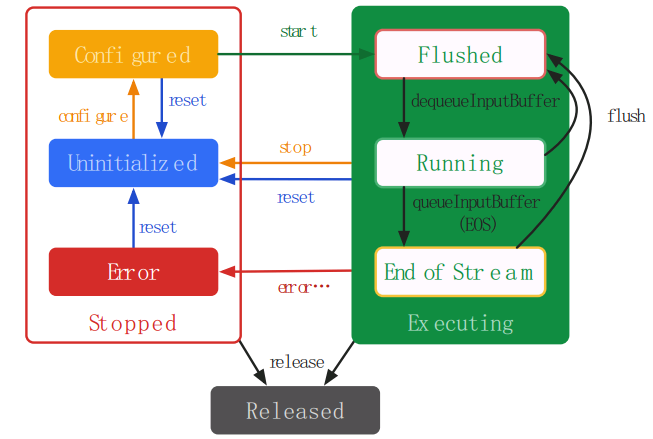
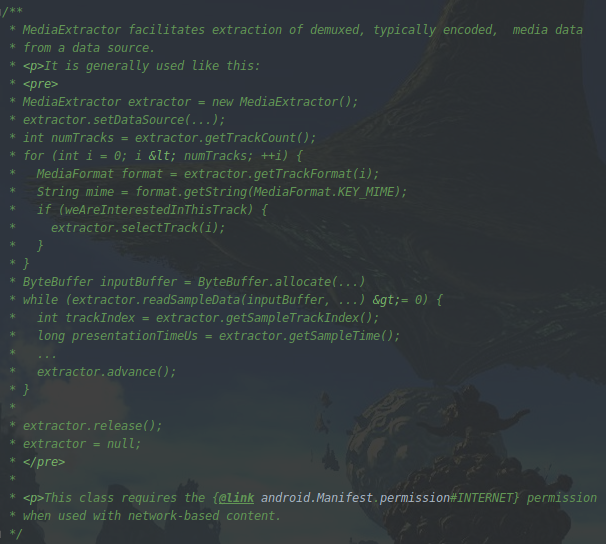

# 如何使用MediaCodec解码音视频

播放一个音视频文件的时候，我们知道需要经过解协议->解封装->解码音频/视频->音视频同步->渲染播放这么几个步骤，
其中解码音视频是整个流程中最核心的一个环节．
每个步骤的详细解释可以参考上篇文章link-xxx

Android平台下解码音视频可以采用软件解码如ffmpeg，或硬件解码MediaCodec来实现．

软件解码：利用CPU进行解码处理，这种方式会加大CPU负担并增加功耗，它的优点则是具有更强的适配性  
硬件解码：调用GPU的专门解码音视频的模块来处理，减少CPU运算，降低功耗．由于Android机型碎片化比较严重,  
硬件解码的实现又依赖于具体的厂商，所以硬件解码的适配性并不是那么友好．

一般而言，在Android设备支持硬解的情况下优先使用Android设备的硬件解码，减少CPU占用，降低功耗；
在硬解不支持的情况下选择使用软解码，至少让音视频能正常播放．
软硬结合，才是王道->_->

当然，本篇文章所要实现的是使用硬件解码MediaCodec的方式来解码一个视频文件．

## MediaCodec简介
android.media.MediaCodec是从API16开始由Android提供的供开发者更加灵活的处理音视频的编解码组件，
与MediaPlayer/MediaRecorder等high-level组件相比，MediaCodec能让开发者直接处理具体的音视频数据，
所以它是low-level API，通常与MediaExtractor, MediaSync, MediaMuxer, MediaCrypto, MediaDrm,
Image, Surface和AudioTrack一起使用

### 基本架构


MediaCodec拥有一组输入输出缓冲队列，采用异步的方式来处理数据．  
流程:
1. 请求或接收到一个空的输入缓冲（input buffer）；
2. 向输入缓冲中填充满数据；
3. 将输入缓冲传递给编解码器处理；
4. 编解码器处理完这些数据并将处理结果输出至一个空的输出缓冲（output buffer）中；
5. 请求或接收到一个填充了结果数据的输出缓冲（output buffer）；
6. 使用输出缓冲中的数据；
7. 将输出缓冲释放给编解码器再次使用．

### 生命周期



当使用工厂方法创建一个编解码器时，它处于未初始化状态(Uninitialized),  
调用configure方法对编解码器进行配置后，它处于配置状态(Configured),  
然后调用start方法让编解码器进入执行状态(Executing)，在执行状态时，  
我们就可以通过上面描述的流程步骤来处理数据了

执行状态(Executing)包含刷新(Flushed)，运行(Running)，流结束(End of Streaming)三个子状态

当调用编解码器的start方法后，它进入执行状态中的刷新子状态；
从第一个输入缓冲被移出队列的时候，它进入运行子状态，编解码器的大部分生命周期都处于这个状态；
当一个输入缓冲被标记为end-of-stream并入队时，它进入流结束子状态，此后编解码器将不再接受新的输入缓冲，
但输出缓冲是能继续产生的，直到end-of-stream到达输出端；

可以调用stop方法结束执行状态，编解码器将回到未初始化状态

当不在使用编解码器时，必须调用release方法释放相关资源

## MediaExtractor简介
在使用MediaCodec解码音频/视频的时候，首先需要获取编码后的音频/视频数据．  
这里我们引入MediaExtractor，它可以分离mp4，flv生成视频h264/mpeg和音频mp3或aac（无adts头)
MediaExtractor的用法很简单，参考官方文档即可



## MediaCodec解码音视频

### 解码视频

创建视频解码器
```
val trackFormat = mediaExtractor.getTrackFormat(videoTrackIndex)
val type = trackFormat.getString(MediaFormat.KEY_MIME)!!
val videoCodec = MediaCodec.createDecoderByType(type)
```

配置解码器format，并指定渲染输出的surface
```
val surface = surfaceView.holder.surface
videoCodec.configure(trackFormat, surface, null, 0)
```

启动解码器
```
videoCodec.start()
```

从MediaExtractor读取数据并喂给解码器
```
// request input buffer
val inputIndex = videoCodec.dequeueInputBuffer(10000)
if (inputIndex < 0) {
    break
}
val inputBuffer = videoCodec.getInputBuffer(inputIndex) ?: continue
// clear old data
inputBuffer.clear()
// read data to input buffer
val sampleSize = mediaExtractor.readSampleData(inputBuffer, 0)
if (sampleSize < 0) {
    // mark end-of-stream to input buffer
    videoCodec.queueInputBuffer(inputIndex,
                0, 0, 0L, MediaCodec.BUFFER_FLAG_END_OF_STREAM)
} else {
    // queue input buffer
    val sampleTime = mediaExtractor.sampleTime
    videoCodec.queueInputBuffer(inputIndex, 0, sampleSize, sampleTime, 0)
    // advance to the next sample
    mediaExtractor.advance()
}
```

从解码器输出缓冲中拿到解码后的视频数据进行处理
```
val outputIndex = videoCodec.dequeueOutputBuffer(decodeBufferInfo, 10000)
if (outputIndex == MediaCodec.INFO_TRY_AGAIN_LATER) {
    break
} else if (outputIndex == MediaCodec.INFO_OUTPUT_FORMAT_CHANGED) {
    // val newFormat = videoCodec.outputFormat
} else if (outputIndex < 0) {
    // do nothing
} else {
    val outputBuffer = videoCodec.getOutputBuffer(outputIndex) ?: continue
    // process decoded data
    // ....
    
    sync(decodeBufferInfo, startMs)
    videoCodec.releaseOutputBuffer(outputIndex, true)
    if ((decodeBufferInfo.flags and MediaCodec.BUFFER_FLAG_END_OF_STREAM) != 0) {
         Log.d(TAG, "codecVideoToSurface: -------------------finish")
         break
    }
}
```

视频解码的时候，我们需要根据视频帧的时间戳来做同步，否则视频帧将很快的进行渲染播放
```
private fun sync(info: MediaCodec.BufferInfo, startMs: Long) {
    val timeDiff = info.presentationTimeUs / 1000 - (System.currentTimeMillis() - startMs)
    if (timeDiff > 0) {
        try {
            Thread.sleep(timeDiff)
        } catch (e: InterruptedException) {
            e.printStackTrace()
        }
    }
}
```

解码流程结束时
```
videoCodec.stop()
```

当不需要再使用解码器时，及时释放资源
```
videoCodec.release()
```

### 解码音频
解码音频的步骤和解码视频的步骤是类似的，此处就不在赘述了，  
如果想要播放解码出来的音频数据，可以使用AudioTrack，详情可以参考Demo代码

当我们通过MediaCodec解码出来了音视频数据后，可以做一些有趣的后处理，比如多个音频的混音，视频的剪辑等

Demo


